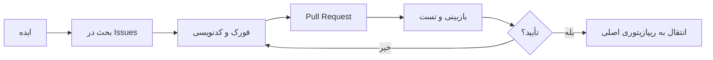

<div dir="rtl">

# 📜 قوانین مشارکت در پروژه

## ساختار ریپازیتوری‌ها

این پروژه از **دو ریپازیتوری** جداگانه استفاده می‌کند:

| ریپازیتوری | هدف |
|------------|------|
| **`bit24-trading-code`** | ذخیره‌سازی **نسخه نهایی و پایدار** ربات‌های آماده |
| **`bit24-bots-with-you`** | محیط **توسعه و همکاری** برای ساخت ربات جدید |

---

## 🎯 قوانین کلی

### 1. ریپازیتوری `bit24-trading-code` (نسخه نهایی)

✅ **فقط ربات‌های تست‌شده و پایدار** در این ریپازیتوری قرار می‌گیرد  
✅ هر ربات باید **مستندات کامل** داشته باشد  
✅ کدها باید **تمیز، کامنت‌گذاری شده و بدون خطا** باشند  
✅ تغییرات فقط توسط **مدیریت پروژه** مرج (Merge) می‌شود  

### 2. ریپازیتوری `bit24-bots-with-you` (محیط همکاری)

✅ **هر کسی می‌تواند ایده بدهد، کد بزند و Pull Request بفرستد**  
✅ تمام مراحل **ساخت، دیباگ و بهبود** اینجا انجام می‌شود  
✅ بعد از **تأیید نهایی**، کد به ریپازیتوری اصلی منتقل می‌شود  

---

## 👥 نقش‌ها

| نقش | وظایف |
|-----|-------|
| **مشارکت‌کننده (Contributor)** | ایده دادن، گزارش باگ، نوشتن کد، Pull Request |
| **بازبین (Reviewer)** | بررسی کدها، تست، پیشنهاد بهبود |
| **مدیریت پروژه (Maintainer)** | تأیید نهایی، Merge به ریپازیتوری اصلی |

---

## 🔄 فرآیند ساخت یک ربات جدید



---

## 📝 قوانین کدنویسی

1. **نام فایل:** باید مشخص و مرتبط باشد (مثلاً `market_buy_irt.py`)
2. **کامنت:** هر فایل حتماً در ابتدا توضیح داشته باشد
3. **خطاگیری:** کدها باید مدیریت خطا (try/except) داشته باشند
4. **ورودی:** API Key و Secret Key حتماً با `input()` گرفته شود (نه هاردکد)
5. **مستندات:** برای هر ربات توضیح کاربرد و نحوه استفاده بنویسید
6. **زبان‌های مورد قبول** :

| زبان |
|------|
| Python |
| Go |
| Node.js |

###     
---

## 🚫 تخلفات ممنوع

❌ قرار دادن **Secret Key** واقعی در کد  
❌ آپلود کدهای مخرب یا حاوی بدافزار  
❌ اسپم در Pull Request یا Issues  
❌ تغییر قوانین بدون هماهنگی  

---

## 🤝 نحوه مشارکت

### گام 1: فورک کنید
```
ریپازیتوری bit24-bots-with-you را فورک کنید
```

### گام 2: یک Issue باز کنید
```
عنوان: [ایده] / [باگ] / [بهبود] - توضیح مختصر
```

### گام 3: کد بزنید و Pull Request بفرستید
```
از شاخه master به main Pull Request بزنید
حداقل 2 نفر کد شما را بررسی کنند
```

### گام 4: منتظر تأیید باشید
```
بعد از تأیید، کد به ریپازیتوری اصلی منتقل می‌شود
```

---

## 📞 ارتباط و هماهنگی

- **Issues:** برای گزارش باگ و ایده‌های جدید
- **Discussions:** برای بحث و گفتگو
- **Pull Requests:** برای ارسال کد

---

## 🌟 قانون طلایی

> **هیچ کد آماده‌ای وجود ندارد. همه چیز را با هم می‌سازیم، یاد می‌گیریم و بهبود می‌دهیم.**

---

**تاریخ اجرای قوانین:** از همین الان  
**نسخه قوانین:** 1.0

</div>

---

## English Version

# 📜 Project Contribution Rules

## Repository Structure

| Repository | Purpose |
|------------|---------|
| **`bit24-trading-code`** | Final & stable bot versions |
| **`bit24-bots-with-you`** | Development & collaboration environment |

---

## 🎯 General Rules

### Repository `bit24-trading-code` (Final)
- ✅ Only **tested & stable** bots
- ✅ Complete documentation required
- ✅ Clean, commented, error‑free code
- ✅ Changes merged **only by project maintainer**

### Repository `bit24-bots-with-you` (Collaboration)
- ✅ Anyone can **suggest ideas, write code, send PR**
- ✅ All **building, debugging, improvement** happens here
- ✅ After final approval, code moves to main repo

---

## 👥 Roles

| Role | Tasks |
|------|-------|
| **Contributor** | Ideas, bug reports, coding, PR |
| **Reviewer** | Code review, testing, suggestions |
| **Maintainer** | Final approval, merge to main repo |

---

## 🔄 Process of Building a New Bot

1. Open an **Issue** with your idea
2. **Fork** and write code
3. Submit **Pull Request**
4. **Review & testing** (at least 2 reviewers)
5. **Approval** → move to main repo

---

## 📝 Coding Rules

1. **Filename:** Clear & relevant (e.g., `market_buy_irt.py`)
2. **Comments:** Every file must have description at top
3. **Error handling:** Use try/except blocks
4. **Input:** Always use `input()` for API keys (no hardcoding)
5. **Documentation:** Explain usage for each bot

---

## 🚫 Prohibited Actions

❌ Hardcoding real Secret Keys  
❌ Uploading malicious code  
❌ Spam in PRs or Issues  
❌ Changing rules without coordination  

---

## 🤝 How to Contribute

### Step 1: Fork
```
Fork the `bit24-bots-with-you` repository
```

### Step 2: Open an Issue
```
Title: [Idea] / [Bug] / [Improvement] - Short description
```

### Step 3: Code & Pull Request
```
Create PR from your branch to main
Wait for at least 2 reviewers
```

### Step 4: Wait for Approval
```
After approval, code moves to main repository
```

---

## 🌟 Golden Rule

> **No ready code exists. We build, learn, and improve everything together.**

---

**Effective Date:** Immediately  
**Rules Version:** 1.0